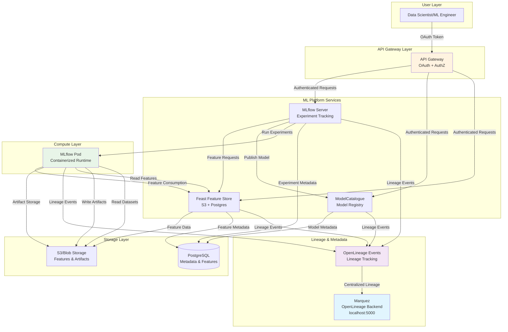

# MLOps Platform Architecture with OpenLineage Integration

## Architecture Overview



## Component Responsibilities

### API Gateway
- **OAuth Authentication**: Validates JWT tokens from identity provider
- **Authorization**: Enforces RBAC policies for ML platform access
- **Request Routing**: Routes authenticated requests to appropriate services
- **Rate Limiting**: Protects backend services from abuse

### MLflow Server
- **Experiment Tracking**: Manages experiments, runs, metrics, parameters
- **Model Registry**: Tracks model versions and lifecycle stages
- **Artifact Storage**: Manages model artifacts and datasets
- **OpenLineage Integration**: Emits lineage events for all operations

### Feast Feature Store
- **Feature Management**: Stores and serves features with point-in-time correctness
- **Feature Discovery**: Provides feature catalog and metadata
- **Offline/Online Serving**: Supports both batch and real-time feature serving
- **Lineage Tracking**: Emits lineage for feature transformations

### ModelCatalogue
- **Model Discovery**: Central registry for published models
- **Model Metadata**: Stores model descriptions, performance metrics, usage info
- **Model Lifecycle**: Manages model approval, deployment, and retirement
- **Integration**: Links with MLflow experiments and Feast features

### Marquez (OpenLineage Backend)
- **Centralized Lineage**: Single source of truth for all data lineage
- **Metadata Store**: Tracks datasets, jobs, runs, and their relationships
- **Graph Visualization**: Provides lineage graphs and impact analysis
- **API**: RESTful API for lineage queries and metadata access

## Data Flow Patterns

### 1. Feature Engineering Flow
```
Dataset → Feast Transformation → Feature Store → MLflow Experiment → Model
```

### 2. Model Training Flow
```
MLflow Run → Feature Consumption → Model Training → Artifact Storage → Model Registry
```

### 3. Model Publishing Flow
```
MLflow Experiment → Model Validation → ModelCatalogue → Production Deployment
```

### 4. Lineage Tracking Flow
```
All Services → OpenLineage Events → Marquez → Centralized Lineage Graph
```

## Key Integration Points

1. **MLflow ↔ Feast**: Feature consumption during training
2. **MLflow ↔ ModelCatalogue**: Model publishing workflow
3. **All Services ↔ Marquez**: Lineage event emission
4. **API Gateway ↔ All Services**: Authentication and authorization
5. **Storage Layer**: Shared S3 and PostgreSQL for consistency
