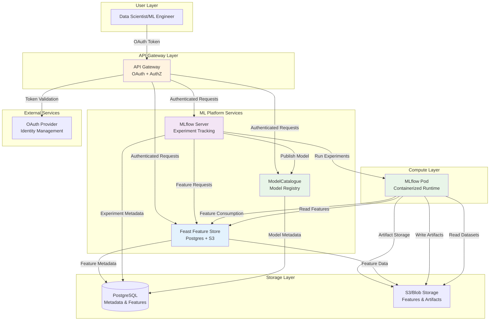

# Phase 1 ML Platform Architecture

## Overview

Phase 1 focuses on the core ML platform components without OpenLineage integration. This provides a solid foundation that can be extended with lineage tracking in Phase 2.

## Architecture Diagram



## Component Responsibilities

### API Gateway
- **OAuth Authentication**: Validates JWT tokens from identity provider
- **Authorization**: Enforces RBAC policies for ML platform access
- **Request Routing**: Routes authenticated requests to appropriate services
- **Rate Limiting**: Protects backend services from abuse
- **Service Discovery**: Manages service endpoints and health checks

### MLflow Server
- **Experiment Tracking**: Manages experiments, runs, metrics, parameters
- **Model Registry**: Tracks model versions and lifecycle stages
- **Artifact Storage**: Manages model artifacts and datasets
- **User Management**: Integrates with API Gateway for authentication

### Feast Feature Store
- **Feature Management**: Stores and serves features with point-in-time correctness
- **Feature Discovery**: Provides feature catalog and metadata
- **Offline/Online Serving**: Supports both batch and real-time feature serving
- **Feature Versioning**: Manages feature schema evolution and versioning

### ModelCatalogue
- **Model Discovery**: Central registry for published models
- **Model Metadata**: Stores model descriptions, performance metrics, usage info
- **Model Lifecycle**: Manages model approval, deployment, and retirement
- **Integration**: Links with MLflow experiments and Feast features

### MLflow Pod (Containerized Runtime)
- **Isolated Execution**: Secure, containerized environment for experiments
- **Resource Management**: CPU/memory limits and quotas
- **Feature Access**: Direct access to Feast feature store
- **Artifact Management**: Uploads artifacts to S3 storage

## Data Flow Patterns

### 1. Feature Engineering Flow
```
Raw Data → Feast Transformation → Feature Store → MLflow Experiment → Model
```

### 2. Model Training Flow
```
MLflow Run → Feature Consumption → Model Training → Artifact Storage → Model Registry
```

### 3. Model Publishing Flow
```
MLflow Experiment → Model Validation → ModelCatalogue → Production Deployment
```

### 4. Authentication Flow
```
User → OAuth Provider → API Gateway → ML Platform Services
```

## Key Integration Points

1. **API Gateway ↔ All Services**: Authentication and authorization
2. **MLflow ↔ Feast**: Feature consumption during training
3. **MLflow ↔ ModelCatalogue**: Model publishing workflow
4. **Feast ↔ Postgres + S3**: Feature storage and metadata
5. **MLflow Pod ↔ All Services**: Isolated execution environment

## Phase 2 Extensibility

The architecture is designed to easily add OpenLineage integration in Phase 2:

- **OpenLineage Events**: Can be added to all service interactions
- **Marquez Integration**: Can be added as a central metadata store
- **Lineage Tracking**: Can be added to all data transformations
- **Metadata Enrichment**: Can be added to existing metadata flows

